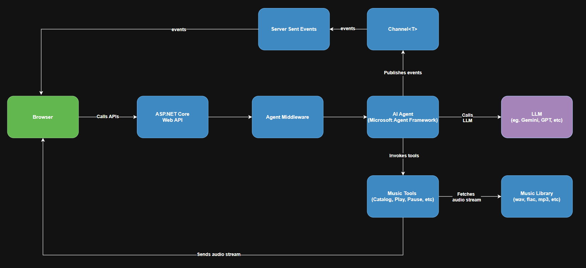

# MusicChat.AI - Music Playback AI Agent

▶ [YouTube Demo](https://www.youtube.com/watch?v=sjC7s7oQeEw)

MusicChat.AI is a minimal AI-powered prototype application demonstrating music streaming using natural language (a chat interface). It is built using [Microsoft Agent Framework](https://learn.microsoft.com/en-us/agent-framework/overview/?pivots=programming-language-csharp) and C#.NET. The prototype demonstrates several AI orchestration as well as software engineering concepts:
- **AI Agents and LLM integration:** ([Google Gemini 3.5 Flash Lite](https://ai.google.dev/gemini-api/docs/models/gemini-3.5-flash-lite) in this implementation)
- **Agent context and session handling:** LLMs are inherently stateless, so in an interactive chat sesssion, maintaining the context is important.  The example demonstrates MAF AgentSession.
- **Tool invocation**: The most powerful aspect of the demo, which demonstrates how you can invoke various tools based on the inference (example, search catalog, play music, etc.)
- **Agent middleware**: Shows how you can intercept the calls to LLM for better observability.  Prototype outputs all requests and responses to the Console.
- **Deterministic controls**: Even though we could leave certain actions to the LLM's decision, it is better to implement them deterministically for better predictability.  One example is returning the results to the client as JSON. We can ask the LLM to format it, but predictability of JSON structuring may be low.
- **Server-Sent Events (SSE) and EventSource**: Shows deliberate decision to decouple music playback from the chat loop for better control. The application uses [SSE](https://en.wikipedia.org/wiki/Server-sent_events) to push events from the server to the browser in real time.  On the browser side, we use EventSource to listen to the SSE events.
- **.NET Channels**: Demonstrates ```Channel<T>``` for message-queue-like processing between different parts of the application. In this example we use ```Channel<string>``` to send messages from the Agent to the SSE.

## How to run
- Clone the repo locally
- Create a ```.env``` file in the project directory
    ```
    GOOGLE_GENAI_API_KEY=<your-gemini-apikey>
    GOOGLE_GENAI_MODEL=gemini-3.5-flash-lite
    LOCAL_LIBRARY_PATH=<path to your music collection>
    ``` 

    **Note:** If you do not have a Gemini API key, go to [https://aistudio.google.com](https://aistudio.google.com/), and create your free API key.
- Run the project and access the application in browser at [http://10.0.0.18:5050](http://10.0.0.18:5050/)


## Architecture

- **ASP.NET Web API**: Exposes RESTful API endpoints as well as SSE endpoints.
- **Agent Middleware**: Intercepts agent requests and responses (for logging, observability, etc) 
- **MAF AI Agent**: Understands user intent and decide which tool to invoke
- **LLM**: Acts as the inference layer
- **Library Service**: Provides the catalog services
- **Music Tools**: Exposes application capabilities to the AI agent.
- **Channel\<T>**: Transports events inside the process. Acts as bridge between the tools and the SSE endpoint.

## Potential Future Improements
- Demonstration of authentication and authorization
- More guardrails
- More tools


